# Eat & Out
<p align="center"></p>

- 팀명 : `Eat & Out`
  - 팀장 : 고용훈
  - 팀원 : 김준기, 조여송, 박시연
- 프로젝트 진행 : 2022.10.24 ~ 2022.12.16
- 기대효과
  - 일부 식당에만 서비스되는 기존 테이블링 앱과 달리 공공데이터를 이용하여 더 대중적인 원격 줄서기 서비스를 제공
  - 웹 어플리케이션 서비스에 미숙하신 분들도 쉽게 이용할 수 있는 서비스를 제공
  - 영수증 인증 리뷰를 통한 신뢰도있는 리뷰서비스 제공

## 프로젝트 정보
1. 프로젝트 주제
    - `AI 플랫폼`을 활용한 예약주문 서비스 웹 어플리케이션 개발
2. 프로젝트 목적(얘는 수정이 살짝 필요함)
    - `제주도 모범음식점현황 데이터`를 이용한 제주도내 `식당/다이닝/카페`의 메뉴들을 예약주문할 수 있는 웹 어플리케이션 구현
      - `협업`을 통해 반응형 웹사이트를 구현
      - 맛집예약 웹사이트에 맞는 `화면 디자인 및 DB설계`
      - `프레임워크`를 이용한 동적인 화면 구현
      - `DBMS`를 이용하여 DB를 구축하고 Spring Container와 연결
      - Java 개발도구와 IDE 사용
      - ERD Cloud와 Notion, Github을 사용한 협업 경험
      - 식당 예약을 하는데 불편함을 개선하고 `신뢰성`있는 리뷰서비스 제공
3. 프로젝트 기능 구현
   1. 로그인/로그아웃/회원가입
      1. 일반로그인
      2. 카카오로그인
      3. 네이버로그인
      4. 구글로그인
      5. 회원가입
   2. 지도api를 이용한 식당위치 서비스
      1. 카카오 맵 api
   3. 검색기능
      1. 카테고리별 검색
      2. 가격 높은/낮은 순서 정렬
      3. 키워드 검색
   4. 주문 빈도에 따른 맛집랭킹 서비스
      1. Orderlist누적 DB를 이용한 실시간랭킹 서비스
      2. Review누적 DB를 이용한 오늘의 추천맛집 서비스
   5. NCP를 이용한 웹 어플리케이션 환경 구축
      1. NCP서버
      2. 챗봇을 이용한 1대1문의
      3. 웹소켓을 이용한 예약-결제 시 고객/매장 알림 서비스
      4. OCR을 이용한 영수증 리뷰
   6. 관리자 페이지 구현
4. 프로젝트 세부일정
   - (세부일정 사진)
5. 역할 분담(아주 상세하게)
   - 고용훈
     - 검색, 식당, 예약-주문, QA테스트, 서버관리
   - 김준기
     - 로그인/소셜로그인, 메인페이지, 전체적인 CSS
   - 조여송
     - 마이페이지, 쿠폰, OCR
   - 박시연
     - 관리자, 위시리스트, DB관리
6. 개발환경 및 수행 도구

   - |언어|웹|개발도구|데이터베이스|협업도구|프레임워크|API|
      |:---:|:---:|:---:|:---:|:---:|:---:|:---:|
      |Java|JavaScript|Eclipse|MySQL|GitHub|SpringBoot|Kakaologin|
      ||HTML5|||Notion|MyBatis|Naverlogin|
      ||CSS6|||GatherTown||NaverOCR|
      ||JQuery|||||NaverChatbot|
      ||AJAX|||||Import|
      |||||||Kakao link|
      |||||||Kakao Map|

7. DB 설계(ERD와 sql을 첨부)
   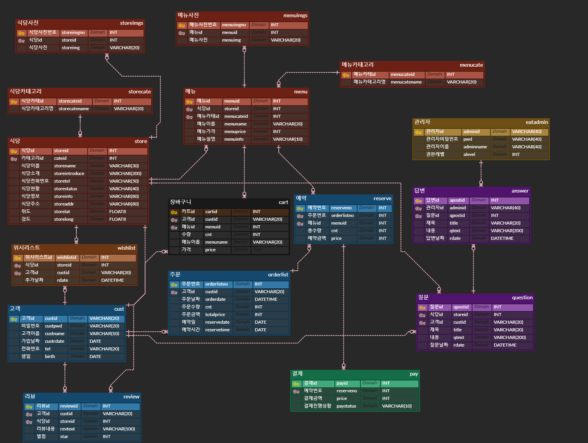
8. UI 설계(Figma사용)

## 프로젝트 결과(스샷 및 gif 넣기)
### index   
   - (index_fullpage.png삽입)
   - index.html
   - MainController.java
   - `랜덤`으로 뿌려지는 맛집, `카테고리`별 맛집, `오늘의 추천` 맛집 순서로 화면에 출력되며
   - 로그인을 하면 해당 계정이 위시리스트에 등록한 위시리스트 목록까지 나옵니다.
   - 컨트롤러의 대부분도 페이지 이동에 관련된 기능뿐입니다.
### 회원가입
   - (signup.png 삽입)
   - signup.html , signupok.html , signupfail.html
   - SignupController.java , AController.java
   - 쉽게 회원가입을 위해 id, password, name, Phone Number, Birth의 정보만 입력
   - ajax를 이용하여 `/checkid`를 발동하여 비동기적으로 id중복확인
### 로그인
   1. 일반로그인
      - 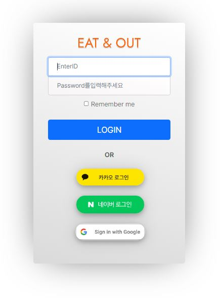
      - login.html , loginfail.html
      - LoginController.java
      - `입력받은 custid`값을 DB에서 조회하고, `입력받은 pwd`와 `DB에서 조회한 custid의 pwd`가 일치하는지 `equals()`로 비교하여 일치하면 session에 저장하여 로그인을 지속시키고, 일치하지않으면 loginfail.html로 보내버립니다.
   2. 카카오로그인
      - 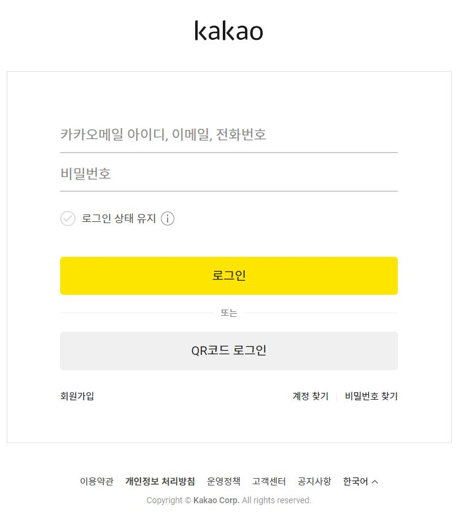
      - KakaoController.java
      - 참고자료 https://developers.kakao.com/docs/latest/ko/kakaologin/rest-api
      - kakaologinAPI의 `REST API방식`을 적용하였습니다. 카카오로그인 버튼을 누르면 GET/oauth/authorize를 통해 카카오계정 로그인 요청을 하고, 카카오 계정 로그인을하면 Redirect URL로 인가코드가 전달이 됩니다.
      - 인가코드를 받으면 `kakao Auth서버`로 인가코드가 전달이 되어 토큰을 받게 됩니다.
      - 해당 토큰을 발급받고 사용자 정보가 `Object형식`으로 내려오게 되고 필요한 데이터를 뽑아서 사용하면 됩니다.
      - `주의할 점`은 Redirect주소를 로그인하려는 IP를 사용해야 정상적인 작동이 됩니다.
      - 또한 Object형식으로 내려오므로 사용자 정보를 제대로 사용하기 위해서는 `형변환`을 해주어야 올바르게 사용이 가능합니다.
      - 저희조는 사용자 정보를 register하는 과정에서 `사용자id값 뒤에 1`을 붙여서 다른 소셜로그인과 겹치지않도록 구분을 해놓았습니다.(카카오계정id와 네이버계정id가 일치하는 경우가 있기때문)
   3. 네이버로그인 
      - 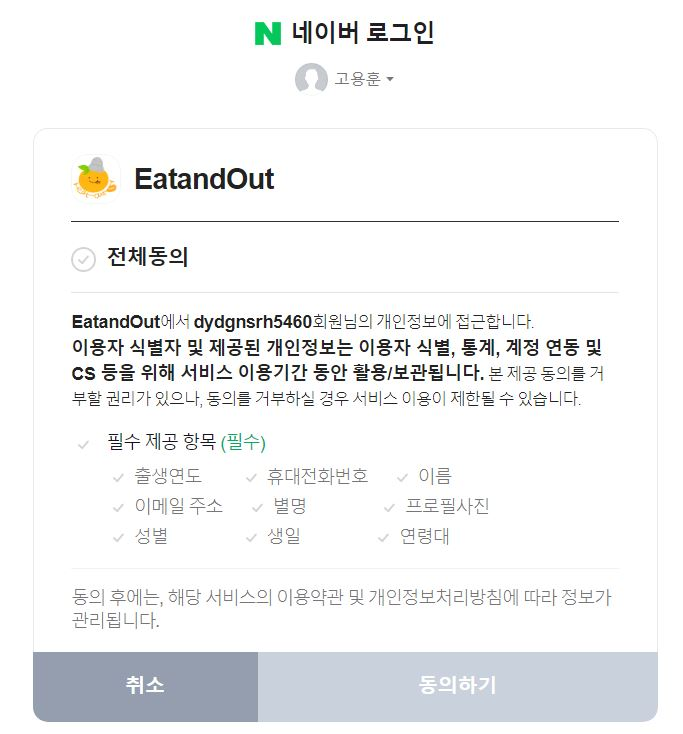
      - NaverController.java
      - 참고자료 https://developers.naver.com/docs/common/openapiguide/apilist.md
      - 네이버의 로그인 방식 `오픈API방식`을 적용하였습니다. 네이버로그인 버튼을 누르면 `GET/POST로 oauth2.0`을 통해 인증을 요청하고, 접근토큰이 발급되어 `JSON형식`으로 데이터가 내려오게 되고 
      - 마찬가지로 Redirect 주소를 로그인하려는 IP를 사용해야 정상적인 작동이 됩니다.
      - 저희조는 사용자 정보를 register하는 과정에서 `사용자id값 뒤에 2`을 붙여서 다른 소셜로그인과 겹치지않도록 구분을 해놓았습니다.(카카오계정id와 네이버계정id가 일치하는 경우가 있기때문)
   4. 구글로그인
      - 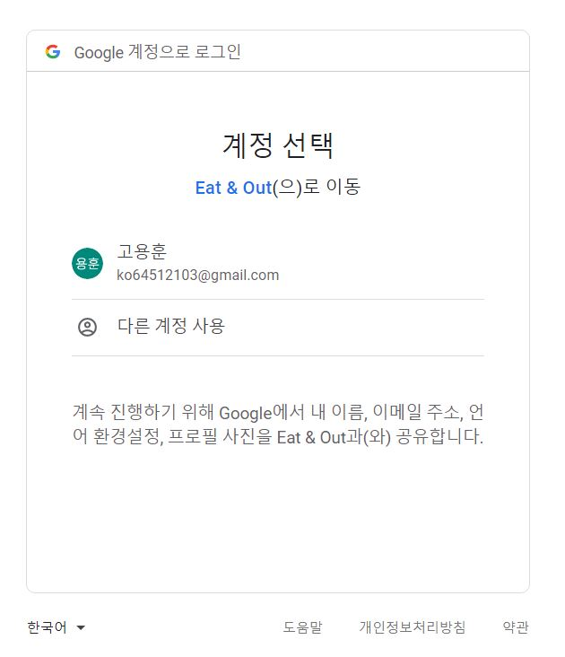
      - OauthController.java
      - 구글로그인 버튼을 누르면 `oauth2`를 통해 인증을 요청하고, 접근토큰이 발급되어 `gson형식`으로 데이터가 내려온다.
      - `gson`을 이용한 로그인 방식으로 `maven`으로 꼭 `xml`을 업데이트 시켜서 `dependency`가 적용이 되야합니다.
      - 주의할 점은 카카오, 네이버와 달리 구글은 `ip주소`가 아닌 `localhost`를 `Redirect주소`로 합니다.
      - `사용자id값 뒤에 3`을 붙여서 다른 소셜로그인과 겹치지않도록 구분을 해놓았습니다
      - ```xml 
		<dependency>
			<groupId>com.google.code.gson</groupId>
			<artifactId>gson</artifactId>
			<version>2.8.5</version>
		</dependency>
		<!--구글 api -->
		<dependency>
			<groupId>com.google.api-client</groupId>
			<artifactId>google-api-client</artifactId>
			<version>1.32.1</version>
		</dependency>
      
### 검색
   - 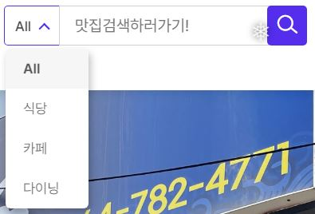
   - index.html , SearchController.java
   - 기본적으로 input text로 `/searchimpl`로 넘어가는 방식입니다.
   - `select`을 이용하여 카테고리별로 검색이 가능하도록 구현했습니다. 디폴트는 전체 검색입니다.
   - 편하게 검색을 하기위해 `onkeyup="enterkey"` function을 주어서 엔터로 `input text`가 넘어가도록 했다.
   - 검색을 하면 `search.html`로 넘어가고 입력한 text에 맞게 DB를 조회하여 출력해 줍니다
   - 주의할 점은 템플릿에 따라 `더미 값`을 주어야 엔터가 발동합니다. 아래는 주의할 점에 대한 예시입니다
```html
<input id="search_input" name="txt" type="text" placeholder="맛집검색하러가기" onkeyup="enterkey()"> //실제 input
   
<input type="text" style="display:none" onkeyup="enterkey()"> // 더미값
``` 
## 스토어디테일
   - 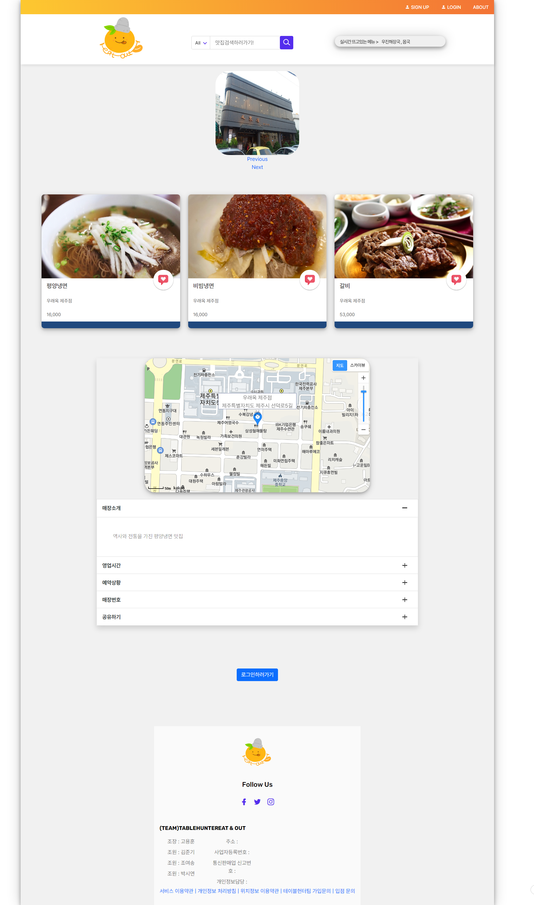
   - storedetail.html , StoreController.java , AController.java
   - search에서 검색된 메뉴를 누르면 `storedetail.html`로 이동하게됩니다.
   - `해당 메뉴의 storeid`를 통해 `/storedetail`로 넘어가고 컨트롤러에서 설정한 모델에서 원하는 데이터를 출력해줍니다.
   - 컨트롤러에서 넘겨준 데이터를 토대로 `Kakao map`을 사용하여 가게의 위치, 상호명, 주소를 지도에 띄워줍니다. 
   - `collapse`를 사용하여 가게의 세부 데이터들을 출력하여 `매장소개, 영업시간, 예약상황, 매장번호, 공유하기`등을 이용할 수 있습니다.
   - `전화버튼`을 누르면 실제로 전화를 할 수 있도록 구현했습니다.
   - 환급정책 문구에 `체크박스`를 넣어서 체크를 해야만 `예약버튼이 활성화` 되도록하였습니다.
   - 위시리스트 버튼을 누르면 `/insertwishlist`로 넘어가서 위시리스트에 추가됩니다.
   - 예약 버튼을 누르면 `/addcart`로 넘어가서 `selectcart`에 `custid`를 조회하여 해당 값이 존재하면 `delectcart`를 하여 `해당custid의 cart`를 초기화 해줍니다. 
   - `해당 값이 존재하지않으면` detail의 데이터들이 cart에 `regist`합니다.
   - `/addcart`가 실행된 후 `0.5초` 뒤 `/reserveimpl`로 넘어가게 됩니다. 0.5초의 timeout을 준 이유는 `ajax`와 `location`이 동시에 실행되면 `일부의 데이터`만 넘어가기 때문입니다.
```javascript	
$('#reserve_btn').click(function() {
			var storeid = $('#storeid').text();
			var custid = $('#custid').text();
			$.ajax({
				url : '[[@{/addcart}]]',
				data : {
					'custid' : custid,
					'storeid' : storeid,
					'cnt' : 0
				}
			})
			var timeout = function() {
				location.href = "[[@{/reserveimpl?custid=}]]" + custid+"&storeid="+storeid;
			}
			setTimeout(timeout, 500);
		});
```
### 예약
   - 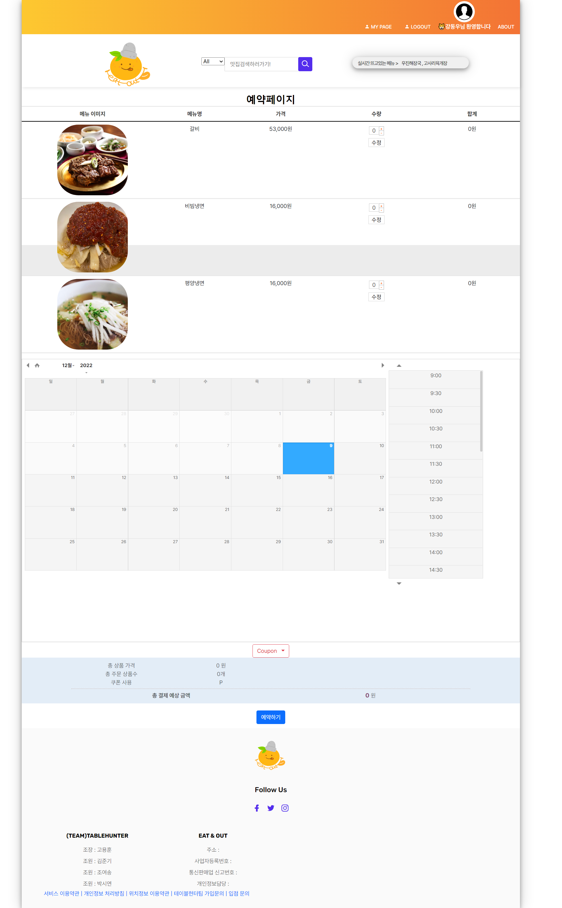
   - 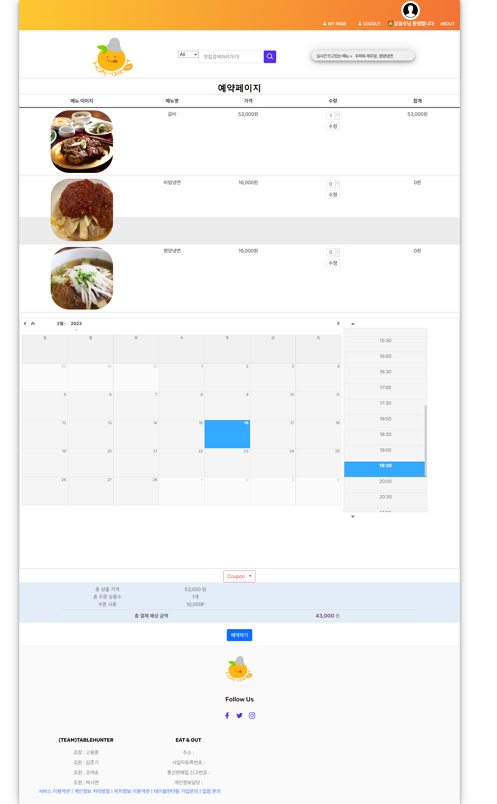
   - 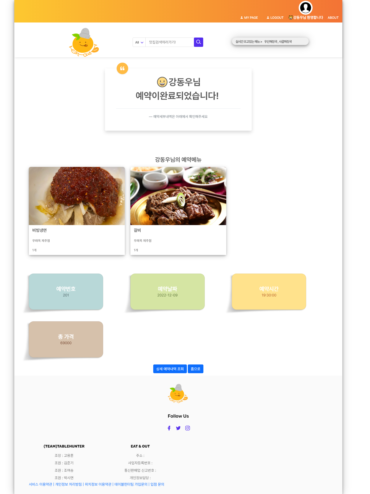
   - reserve.html , ReserveController
   - /addcart된 데이터가 reserveimpl을 통해 모델에 저장되어 reserve.html에 뿌려집니다.
   - 메뉴의 수량 변경은 동기적으로 수정버튼을 통해 /update로 넘어가 수량이 변경되고, 변경 후에 totalprice가 바뀝니다.
   - datetimepicker를 사용하여 날짜와 시간대를 선택하게 하였습니다.
   - 쿠폰을 적용시켜 결제 금액을 할인받을 수 있습니다.
   - 예약하기 버튼을 누르면 첫번째 admin의 웹소켓과 연결이 됩니다. 두번째 import의 결제API가 실행되어 결제가 진행이 됩니다.
   - 결제가 성공적으로 진행되면 /reserveimpl2로 데이터가 넘어가고 cart데이터를 토대로 orderlist와 reserve에 regist 후 해당 cart데이터를 delete시킵니다. regist 시킨 데이터는 reservesuccess로 넘깁니다.
   - 결제가 끝나고 reservesuccess.html로 넘어가면 웹소켓으로 연결된 admin계정에 예약알림 메시지가 넘어가고 고객에게는 카카오링크api가 작동하여 카카오톡으로 메시지를 보냅니다.
   - 주의사항 저희 조에서 사용한 datetimepicker는 php기반으로 dateformat이 다릅니다. 따라서 java기반의 dateformat으로 바꿔 사용해야 합니다.
```javascript
$.datetimepicker.setLocale('ko');
			$.datetimepicker.setDateFormatter({
				parseDate : function(date, format) {
					var d = moment(date, format);
					return d.isValid() ? d.toDate() : false;
				},

				formatDate : function(date, format) {
					return moment(date).format(format);
				},

				formatMask : function(format) {
					return format.replace(/Y{4}/g, '9999').replace(/Y{2}/g,
							'99').replace(/M{2}/g, '19').replace(/D{2}/g, '39')
							.replace(/H{2}/g, '29').replace(/m{2}/g, '59')
							.replace(/s{2}/g, '59');
				}
			});
			$('#datetimepicker').datetimepicker(
					{
						format : 'YYYY.M.D H:mm',
						formatTime : 'H:mm',
						formatDate : 'YYYY.M.D',
						minDate : 0,
						inline : true,
						allowTimes : ...
					});
```
   - 웹소켓을 사용할 때 제일 중요한 부분은 connect()
```javascript
function connect() {
				var socket = new SockJS('주체가 되는 ip/ws');
```
   - 이 부분의 주체가 되는 ip는 소통의 기준이 되는 ip주소를 넣으면 된다. 만약 127.0.0.1:8080이 주체이고 내가 사용하는 곳이 127.0.0.1이면 해당 자리에 127.0.0.1:8080을 넣고 연결을 하면 주체가 되는 ip와 웹소켓으로 연결이 된다.
   - 결제 api에서는 변수들을 직접 넣기 위해서는 함수 내부에서 변수를 설정해 주어서 넣는게 가능하다
```javascript
var IMP = window.IMP; // 생략 가능
IMP.init("import키값");
var custid = '[[${session.logincust.custid}]]';

기타등등 ...(생략)

function requestPay() {
	var reservedate = $('#datetimepicker').val();
	var totalPrice = $('#totalpricespan span').text();
	var totalPrice2 = parseInt(totalPrice);
	// IMP.request_pay(param, callback) 결제창 호출
	IMP.request_pay(
		{ // param
		pg : "html5_inicis",
		pay_method : "card",
		merchant_uid : 'merchant_' + new Date().getTime(),
		name : "Eat&Out",
		amount : totalPrice2, 
		buyer_email : "",
		buyer_name : custid,
		buyer_tel : "010-4242-4242",
		buyer_addr : "서울특별시 강남구 신사동",
		buyer_postcode : "01181",
		m_redirect_url : 
		},
			function(rsp) { // callback
				if (rsp.success) {
					jQuery.ajax({
							      url : "", //결제 완료 후 컨트롤러를 건드리고 싶으면 이부분을 건드리는 것이 아니다
									method : "POST",
									headers : {
												"Content-Type" : "application/json"
													},
									data : {
											imp_uid : rsp.imp_uid, //결제 고유번호     
											merchant_uid : rsp.merchant_uid
												}
									})
							.done(
								function(data) { // 결제 완료 후 컨트롤러를 건드리는 부분
									sendLinkDefault();
									sendTo();
									location.href = "[[@{/reserveimpl2?custid=}]]"+ custid + '&reservedate=' + reservedate
									})
				   } else {
						alert("결제에 실패하였습니다. 에러 내용: "+ rsp.error_msg);
					   }
				});
			}
```
### 마이페이지
   - (mypage.png , mypage_orderlist.png , mypage_orderdetail.png 등등 삽입)
### 주문 빈도에 따른 맛집랭킹 서비스
   - (rollingtext.gif)
   - index.html , MainController.java
   - Orderlist의 누적된 DB를 종합하여 상위 5개 메뉴에 대해 과거 네이버 실시간검색과 비슷한 느낌으로 출력합니다.
```javascript
<div class="container1">
   <div class="rollingbanner">
      <div class="title">실시간 뜨고있는 메뉴 > </div>
      <div class="wrap">
            <ul>
               <li class="current"><a href="#" th:text="${session.ranking?.storename}+' , '+${session.ranking?.menuname}">storename4, menuname4</a></li>
               <li class="next"><a href="#" th:text="${session.ranking2?.storename}+' , '+${session.ranking2?.menuname}">storename4, menuname4</a></li>
               <li><a href="#" th:text="${session.ranking3?.storename}+' , '+${session.ranking3?.menuname}">storename4, menuname4</a></li>
               <li><a href="#" th:text="${session.ranking4?.storename}+' , '+${session.ranking4?.menuname}">storename4, menuname4</a></li>
               <li class="prev"><a href="#" th:text="${session.ranking5?.storename}+' , '+${session.ranking5?.menuname}">storename4, menuname4</a></li>
            </ul>
      </div>
</div>
```
   - `<div>`에 `class="container"`를 붙여주고 내부 `<div>`에 rollingbanner, title, wrap을 붙여줍니다.
   - 각 `<li>태그`에 class를 주고 current, next, prev를 1개씩 들어가게 줍니다.
   - 스크립트 부분에서 rollingCallback을 3초마다 작동시켜주면
   - 먼저 prev클래스에서 prev가 삭제되고 current를 조회하여 current를 삭제하고 prev를 추가합니다
   - next클래스를 조회하고 next를 삭제하고 current를 추가하며 그 다음 `<li>태그`에 next를 추가해 주며 `<li>태그`가 돌아가도록 합니다.
```html
<script>
document.addEventListener('DOMContentLoaded', ()=>{
    var interval = window.setInterval(rollingCallback, 3000);
})
function rollingCallback(){
    document.querySelector('.rollingbanner .prev').classList.remove('prev');

    let current = document.querySelector('.rollingbanner .current');
    current.classList.remove('current');
    current.classList.add('prev');

    let next = document.querySelector('.rollingbanner .next');
    if(next.nextElementSibling == null){
        document.querySelector('.rollingbanner ul li:first-child').classList.add('next');
    }else{
        next.nextElementSibling.classList.add('next');
    }
    next.classList.remove('next');
    next.classList.add('current');
}
</script>
```
### 관리자 페이지

## 트러블슈팅(마지막날까지 추가하기)
- 고용훈
  - `CRUD 테스트` 중 `insert`가 안먹히는 현상 → `DTO순서`와 `DML 컬럼의 순서`가 맞지 않아서 발생한 현상→ `DTO의 순서`를 바꿔주면서 해결
  - `MyBatisSystemException` →마이바티스에서 파라메터 속성값을 잘못 설정함 → 속성에 맞게끔 수정→마이바티스 작성시 똑바로 보자
  - `search_btn`이 안먹히는 현상발생 →버튼 이벤트에 `alert`을 해줬는데도 `alert`이 안뜨는 상황→버튼에 걸려있는 `css`가 문제다 → `css`문제가 아니었고 `JQueryScript` 순서 문제여서 제일 위로 올려주며 해결
  - `search.html`에서 사진이 등록되지 않은 데이터가 나오지 않는 현상 → `INNER JOIN`을 `LEFT OUTER JOIN`으로 바꿔서 왼쪽테이블데이터를 기반으로 다 나오도록 하여 해결
  - `git pull` 하는 과정에서 `dirty_index`가 발생함→ `git stash`를 사용하여 전 단계로 돌아가고 `pull`을 하여 받고 다시 `stash`에서 `stash change`를 사용하여 `merge`를 하여 해결
  - `detail.html`에서  `reserve_btn`으로 `custid`를 넘기려고 함→`[[${session.logincust.custid}]]` 이 비로그인일때 디테일에 못들어가게됨. 해당로그인 세션이 없기 때문. → 순서를 바꿔도 소용이 없음, 주석으로 막아도 안됨 → `2중 thymeleaf` 를 줘서 `session.logincust ≠null` 일때만 `custid`값을 부여하도록 함
  - `소셜로그인 컨트롤러`를 건드리는 중 데이터 중복이 뜸 → 해당 `cust`데이터가 있는지 확인을 한 후 없으면 `register`로 데이터 등록, 있으면 `get`으로 로그인을 하도록 변경
  - `reserve.html`에서 `cnt`버튼으로 수량을 변경하고 수정을 누르면 `sql`상에서도 수량이 바뀌고 하단에 총 합계량도 변화함. 그러나 오른쪽에 `totalprice`가 안먹히는 현상이 발생함 → 즉각적으로 `totalprice`를 계산하도록 코드를 입력했고, `finaltotalprice`부분을 삭제하고 `totalprice`로 대체
  - `reserve.html`에서 데이터가 `일부` 출력되지 않는 현상이 발생함.  `sql`엔 온전히 데이터가 다 들어가있음. 새로고침을 하면 원하는 데이터가 다 출력됨 → `ajax`와 `locationhref`를 동시에 사용하여 발생한 문제 → `ajax`가 `regist`하는 중간에 페이지 이동이 되버리면서 이동 전까지 `regist`한 것만 페이지에 출력됐고 새로고침을 하면 정상적으로 다 출력 → `setTimeout`을 `0.5초`를 주어 임시로 둘이 동시에 작업되지 않도록 하였다
  - `input`으로 `date와 time`을 주어 `날짜와 시간` 을 선택하여 해당 데이터를 `orderlist`에 넣으려 하는데 데이터를 읽지 못함 → `datepicker` 값을 두개를 주어서 `SimpleDateFormat`을 이용하여 하나는 날짜, 하나는 시간 값으로 받게끔 만들어서 각각을 `orderlist`에 `insert`. 아래 사진처럼 잘 들어와있다
      
      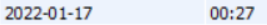
      
  - `결제API`를 진행하는 도중 `NullPointerException` 이 떴는데 `String.length()` 의 `text`가 `null`이라고 뜨면서 진행이 안돼는 상황 → `ajax의 url`이 잘못된 것
  - `select list is not in group by clause and contains nonaggregated column 'eatnout.s.storeid' which is not functionally dependent on columns in group by clause; this is incompatible with sql_mode=only_full_group_by` 
  해당 오류는 `group by`를 사용할 때 호환이 안돼는 오류. 
  →해당 `xml`의 문구를 수정하여 해결.
  - `wishlist`가 로그인 할때만 출력되던 현상
  → `/` 에 로그인 했을 시 id값이 들어가도록 수정하여 해결
  - `cartDB`에 쓰레기값들이 계속 누적되는 현상
  → `cart`에 `register`되기 전 `delete`를 하여 해당 `custid의 cart`를 초기화하여 해결
  - `모바일(모바일+태블릿)`에서 실행 시 결제 페이지가 제대로 작동하지 않는 현상 → 해당 현상은 `pc와 모바일`의 `결제 모듈 작동 방식`에 의한 차이로, `pc`는 모듈을 직접띄워주며 실행되는 반면 `모바일`은 `redirect`로 새창으로 이동해버려서 작동하지 않는 현상이 발생했다. `m_redirect_url`을 주어서 모바일 결제가 진행된 후 `m_redirect_url`의 `redirect페이지`로 이동하게하여 해결
  - `No 'Access-Control-Allow-Origin' header is present on the requested resource.` 에러는 `config` 에서 세팅한 `ip` 값과 `New socketJS` 에서 설정한 `ip`값이 달라서 발생한 에러→해당 ip값을 맞춰주면 `connected`
  - adminpage에 chart가 뜨지 않는 현상 → 1. 데이터를 필요한 것만 남긴다 2. 라이브러리 순서 확인
  - java.lang.IllegalArgumentException: Illegal pattern character 'I’ , java.text.ParseException: Unparseable date: "undefined”. `d.m.y h:i:s`를 `yyyy.MM.dd HH:mm` 로 바꾸는 과정에서 생긴 parsing오류 -> 먼저 php인 `d.m.y h:i` 는 `yyyy.MM.dd HH:mm` 와 숫자가 다르기 때문에 1차적으로 html에서 `d.m.y h:i → YYYY.M.D H:mm` 로 변환시켜준다. 그리고 컨트롤러로 넘기면서 `YYYY.M.D H:mm → yyyy.MM.dd HH:mm`로 `DateFormat`을 잡고 변환시켜준다. 이때 주의해야할 점은 컨트롤러 부분에서 받아들이는 `DateFormate`이 `yyyy.MM.dd HH:mm`형식 이어야한다

- 김준기
  - `Login` 기능 구현시 `input 값`을 못받아오는 현상 → `input 태그` 내의 `name 값`을 `DTO의 변수명`과 일치하게 셋팅하니을 넘겨줘서 해결.
  - `반응형 웹 템플릿` 의 주 `src` 들이 적용되지 않던 현상 → `index.html`의 `body`부분이 아닌 `head` 부분으로 옮겨주고, /설정해줌으로 해결 → 상단 `search bar` 창 호환 문제 해결완료
  - `navbar-search -style5` class로 묶여있는  `div`들  `justify-content:between` 제거 → 이유 브라우저 창이 줄어듬과 동시에 반응형 동작이 일어나는데, 블록을 잡아먹어 `search-bar` 충돌로 뭉그러짐현상이 동작되서 제거후 해결
  - `search-bar` 위치조정, 브라우저 크기 줄어들시 꺠지는현상 발생 → 위와 마찬가지로 `justyfy-content` 제거후, `position:relative` 값과 `margin-left` 값을 주어 센터에 고정후 충돌현상 해결
  - `LoginPage` 클릭시 Search-bar 부분 css 적용이 안됨 (SELECT 부분) → `플러그인` 끼리의 충돌로 인한 현상, 기존 부트스트랩 플러그인들 정리해주니 충돌현상 제거완료
  - `소셜로그인 API`  → 카카오,네이버, 구글등 API를 사용할때, 명세서를 꼼꼼히 읽자 → 네이버 로그인시 요청코드의 한 단어를 빼먹고 URL 요청 시도 → 값을 제대로 return 하지 못하여 고생했음.  → 명세서 요청 URL대로 로그인 버튼 설정후 정상기능 작동
  - `Google Login` → 구글로그인 설정시 , scope 값을 가져오는 `Google API` 서버 주소를 기본 설정값으로 설정하였더니, 정보를 가져오는 팀원과 못가져오는 팀원으로 나뉨 → 서버주소를 가져오고싶은 스코프값으로 바꿔주니 해결 → scope=email,profile
  - `NCP` 연동시 mainpage에 Logo 값을 렌더링 못하는 현상 → 서버올릴시 파일명을 체크하자 경로상 Logo7.svg로 저장되어있었으나 img 태그를 logo7.svg로설정하여 못불러옴.
  - `NCP` 연동시 카카오로그인 실행시 값을 DB에 저장못해줌 → 공인IP로 바뀌며 서버주소가 바뀌기 때문에 KakaoService 에서 redirect url도 신경써줘야함. 도메인주소 재설정후 해결

- 조여송
  - 회원정보 관련 기능들에 필요한 회원 데이터를 `session`과 `model`에 저장함에 있어 어떻게 나눌 것인가 → `session` 만으로 회원 관련 모든 기능에 쓸 수 있지만 서버에 무리를 줄 수 있으므로 `model` 객체를 사용할 것
  - 회원정보 수정 후 다시 마이페이지로 리다이렉트 되지 않음 → `attr()` 메서드 `action` 속성에 상위 맵핑 경로 작성으로 해결
  - 타임리프 파싱에러(Could not parse as each:)로 리스트를 반복으로 가져올 수 없는 현상 → `th:each = ”ex : ${example}”` 처럼 참조변수와 스페이스 구분을 확실히 줘서 해결
  - `background: url()` 이미지를 경로에서 가지오지 못함 → 모든 경로 시작부분에 파싱 `“/”` 추가해줘서 해결
  - `th:href`로 Controller 호출 시 세션 값을 원하는 메서드의 매개변수로 주지 못할 경우 → `session.getAttribute();`로 Object에 대입 후 DTO로 형변환하여 getString()로 저장
  - `<button>` 클릭시 input안의 값을 원치 않아도 가져오게 됨 → script 문법은 틀리지 않았고, `<form>` 안에 `<button>`이 작성되어있었음, 앞으로도 유심히 볼 것
  - `GROUP BY` 를 사용할 경우, 비집계 컬럼은 select 할 수 없음 → 공부 할 것
  - 제이쿼리 `<input type=”password”>` 에 값이 없는데도 null로 확인을 못함 → 전 메서드 `$.attr("disabled", **true**);` 에서 막아놓았었음 / if문 작성시 return 꼭 작성할 것
  - // 변수에 타임리프 `[[${…}]]` 로 담을때 `<script>` 에 `th:inline="javascript"` 추가해주기 → 알아서 문자열에 따옴표를 추가해주고 알아서 객체화를 해준다.
  - 
  - `[application.properties](http://application.properties)` directory 경로 뒤에 `/` 로 끝내기

- 박시연
  - `어노테이션` 문제로 `JUnit` 에러 발생 → 전부 삭제 후 다시 코딩으로 해결 (`Lombok`에러 아니었음)
  - maincenter html에 wishlist를 뿌리는 작업 중 `session`에서 id를 읽어오지 못하는 문제 발생 →
  - 위시리스트 삭제 과정에서 링크에 mypage가 중복되던 문제 → 매핑 문제. controller와 html 수정으로 해결
  - admin 메인 페이지에 chart 뿌리는 과정 중 $ajax가 정의되지 않는 문제 발생 →

## 고찰
- (작성 중)
- NCP 서브계정의 한계로 Naver api를 마음껏 사용하지 못했습니다.
- 카카오 비즈니스 채널 개설이 불가능하여 카카오 메시지 api 대신 최대한 비슷하게 카카오 link api를 이용하였습니다.
- 

## 후기
- (작성 중)
- 고용훈
  - ㅁ
- 김준기
  - ㅁ
- 조여송
  - ㅁ
- 박시연
  - ㅁ
